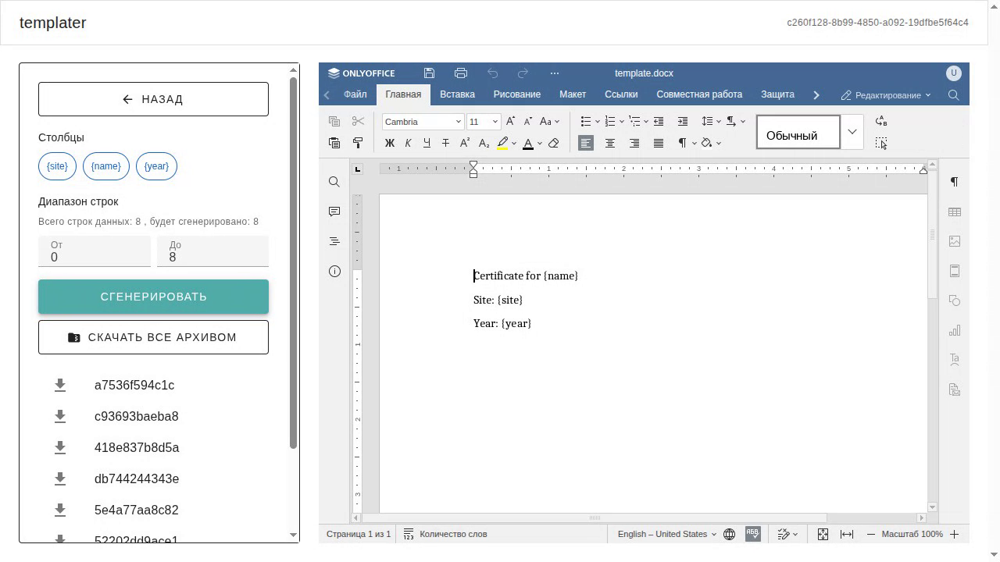
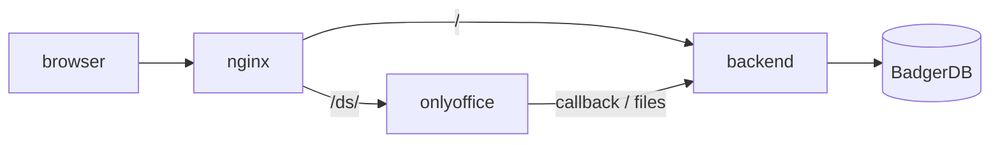

# Templater

Templater — сервис для автоматической генерации документов Word по шаблону и данным из Excel. Метки в шаблоне (`{фамилия}`, `{сумма}`) совпадают с названиями столбцов; на каждую строку таблицы получается отдельный файл.

[](examples/demo.webm)


&nbsp;&nbsp;&nbsp;&nbsp;&nbsp;&nbsp;&nbsp;&nbsp;&nbsp;&nbsp;&nbsp;&nbsp;

[OpenAPI](openapi.yaml) · [Примеры](examples/) · [MIT](LICENSE)

## Возможности

- Загрузка xlsx и docx, правка шаблона в OnlyOffice
- Подстановка столбцов Excel в плейсхолдеры
- Скачивание результата архивом
- Анонимная JWT-сессия: файлы привязаны к временному пользователю

## Быстрый старт

Нужны Docker и [mkcert](https://github.com/FiloSottile/mkcert).

```bash
./scripts/local-https.sh
./scripts/local-up.sh
```

Открыть [https://templater.local:8443](https://templater.local:8443)  
В `/etc/hosts`: `127.0.0.1 templater.local`. Слушает 8088/8443, хостовые 80/443 не занимает.

Без Docker: задать `JWTSecret` и `OnlyOfficeJWTSecret` в `.env`, поднять OnlyOffice, затем `go run ./cmd/app` и сборка frontend (`npm ci && npm run build`).

## Примеры


| Файл                                                                               | Назначение                                                         |
| ---------------------------------------------------------------------------------- | ------------------------------------------------------------------ |
| [examples/invoice.csv](examples/invoice.csv)                                       | Счета: `number`, `client`, `item`, `qty`, `price`, `total`, `date` |
| [examples/invoice.txt](examples/invoice.txt)                                       | Текстовый шаблон счёта                                             |
| [examples/sample.xlsx](examples/sample.xlsx) / [sample.docx](examples/sample.docx) | Короткий демо-набор `site` / `name` / `year`                       |
| [examples/demo.webm](examples/demo.webm)                                           | Запись сценария (~10 с)                                            |


Пересобрать xlsx/docx:

```bash
go run examples/gen.go
```


## Архитектура




Публичный URL — `PublicBaseURL`. Хост для OnlyOffice (`extra_hosts`) — `PUBLIC_HOST`.

## Конфигурация


| Переменная            | Зачем                                                            |
| --------------------- | ---------------------------------------------------------------- |
| `PublicBaseURL`       | URL, по которому браузер и OnlyOffice ходят в API                |
| `PUBLIC_HOST`         | Имя хоста без схемы; если пусто, деплой берёт из `PublicBaseURL` |
| `JWTSecret`           | Подпись сессий                                                   |
| `OnlyOfficeJWTSecret` | JWT OnlyOffice                                                   |
| `OnlyOfficeURL`       | Внутренний адрес Document Server                                 |
| `CORSOrigins`         | Разрешённые origin                                               |
| `GO_ENV`              | `production` запрещает дефолтные секреты                         |


## API

Полная схема: [openapi.yaml](openapi.yaml).


| Метод  | Путь                       | Auth               | Назначение                                  |
| ------ | -------------------------- | ------------------ | ------------------------------------------- |
| `POST` | `/api/user`                | —                  | сессия и JWT                                |
| `POST` | `/api/xlsx_info`           | Bearer             | листы xlsx                                  |
| `POST` | `/api/create_task`         | Bearer             | задача: `exel_file`, опционально `doc_file` |
| `GET`  | `/api/columns`             | Bearer             | имена столбцов                              |
| `GET`  | `/api/sheet_info`          | Bearer             | диапазон листа                              |
| `GET`  | `/api/onlyoffice/config`   | Bearer             | конфиг редактора                            |
| `POST` | `/api/run_task`            | Bearer             | генерация docx                              |
| `POST` | `/api/download_zip`        | Bearer             | zip по хешам                                |
| `GET`  | `/api/files/{hash}`        | Bearer или `token` | скачать docx                                |
| `POST` | `/api/onlyoffice/callback` | OnlyOffice         | сохранение шаблона                          |
| `GET`  | `/ping`                    | —                  | `pong`                                      |


`run_task`: query `task_id`, `sheet_name`, `use_first_row_as_columns`, `min_row`, `max_row`.

## Ограничения


| Что                      | Лимит                       |
| ------------------------ | --------------------------- |
| Загрузка xlsx/docx       | 100 МиБ                     |
| Строк за один `run_task` | 100                         |
| Нумерация строк Excel    | с 1 (`min_row` / `max_row`) |


Больше 100 строк — несколько вызовов `run_task` с разными диапазонами.

## Разработка

```bash
go test ./...
go test -bench=BenchmarkConvert -benchtime=3x ./internal/exdocConverter
python3 -m pytest e2e/test_open.py
```

E2E нужен поднятый `local-up` и Selenium Grid на `:4444`.  
Бенчмарк: 10 / 100 / 1000 строк на конвертере (HTTP-лимит — 100 строк за запрос).

## Деплой

Push в `main`: `go test`, сборка образов в GHCR.  
Выкладка: `workflow_dispatch` (тег `latest` или sha). На сервер уходят `docker-compose.yml`, `nginx/nginx.conf` и `.env`.

## Лицензия

[MIT](LICENSE)